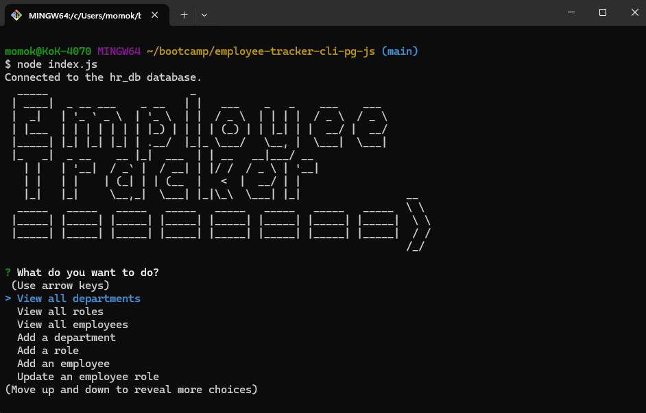
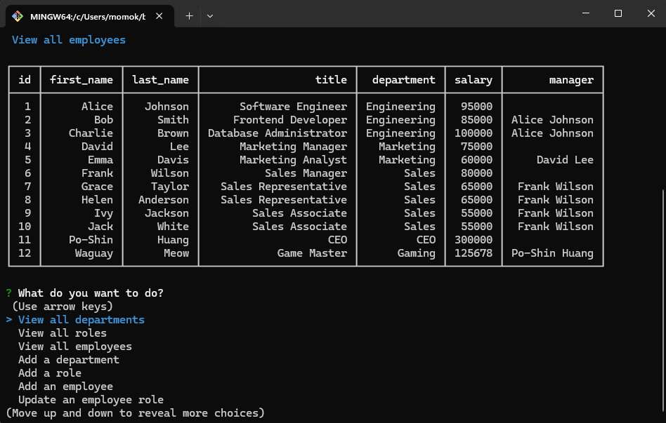
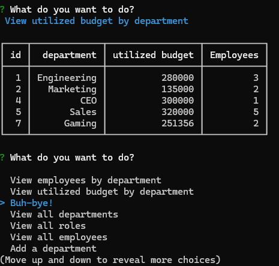
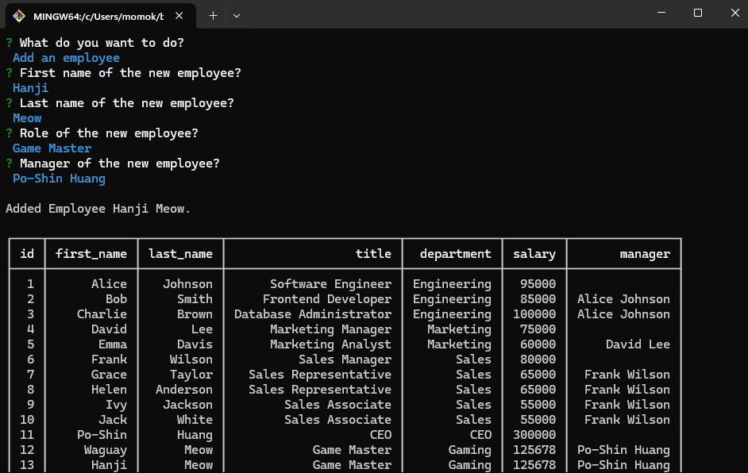
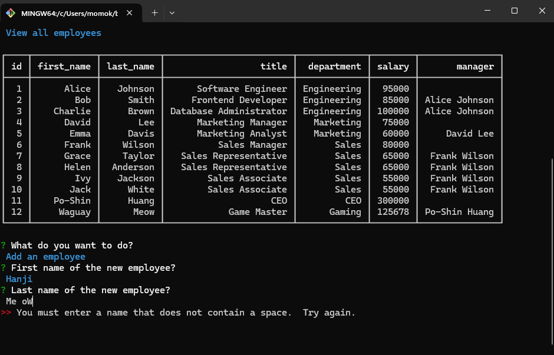
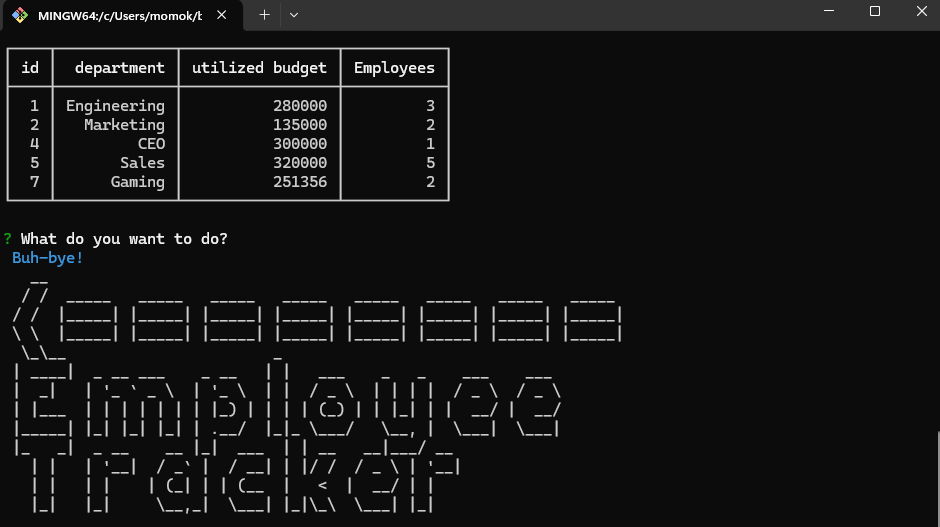

# employee-tracker-cli-pg-js

***
## Table of content
- employee-tracker-cli-pg-js
  - [Description](#Description)
  - [Installation](#Installation)
  - [Usage](#Usage)
  - [Tests](#Tests)
  - [Contributing](#Contributing)
  - [License](#License)
  - [Questions](#Questions)
  - [Screenshot](#Screenshot)
***
## Description
[DEMO video](https://drive.google.com/file/d/1S4SNh37F5k1tZPZPb42iZdPwaa7KKU7J/view?usp=drive_link) 
This is to setup an Employee Tracker CLI tool that interacts with a Postgres databse.  Each employee has a role and each role belongs to a department. You can view all departments, roles, employees, employees by manager, employees by department, and utilized budget by department, and add a department, a role and an employee and update an employee role.  See the sql files in db for the schema and seeded data.

## Installation
- The generator requires npm and Postgres.  
  - [Node.js/npm installation](https://docs.npmjs.com/downloading-and-installing-node-js-and-npm)
  - [Postgres installation](https://www.postgresql.org/download/)
1. Clone the repo: https://github.com/momokokong/employee-tracker-cli-pg-js
2. In the terminal, move to where the cloned local repo is.
3. `npm install`
   - If it does not automatically install the required modules, follow the below instructions:
     - `npm i console-table-printer@2.12.1`
     - `npm i figlet@1.7.0`
     - `npm i inquirer@8.2.4`
     - `npm i pg@8.12.0`
     - `npm i validator@13.12.0`
4. Set up the database schema and seeds data: In the terminal go to the folder db/
   - `psql -U postgres` you will need to enter the password for Postgres user postgres. In the Postgres bash:
     - `\i schema.sql` 
     - and then `\i seeds.sql`
     - now the test data is ready, exit by `\q`
5. Go back to the root folder. Start the Employee Tracker by `node index.js` in the terminal. 

## Usage
1. Follow the on screen prompts.
2. There are some basic input validations therefore salary must be number, names do not contain a space and etc.
3. In the folder db/, you can use reset.sql to return the database hr_db back to the initial state.

## Tests
Use psql in the terminal or pg admin to real-time monitor the data manipulation.

## Contributing
Contact me.  Find my information in the [Questions](#Questions) section.

## License
This project adopts WTFPL license practices. Check the website for license details: [License: WTFPL](http://www.wtfpl.net/about/)

## Questions
[momokokong's GitHub profile.](https://github.com/momokokong)

[Po Shin Huang Linkedin profile](https://www.linkedin.com/in/poshinhuang/)

## Screenshot
- How to start and the starting screen

- Showing view all employees

- Showing view utilized budget by department 

- Add an employee  

- There are validations for user inputs 

- choose Buh-bye to exit

